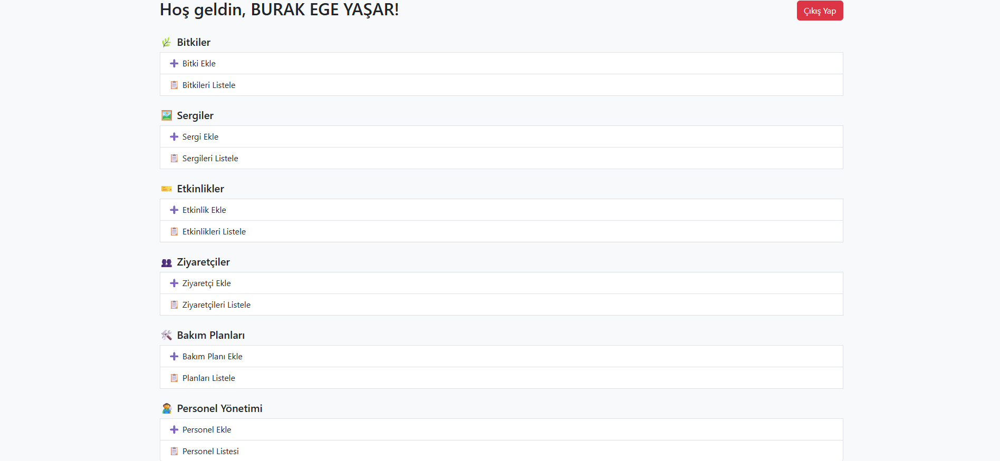
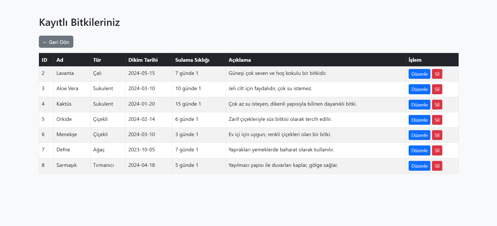
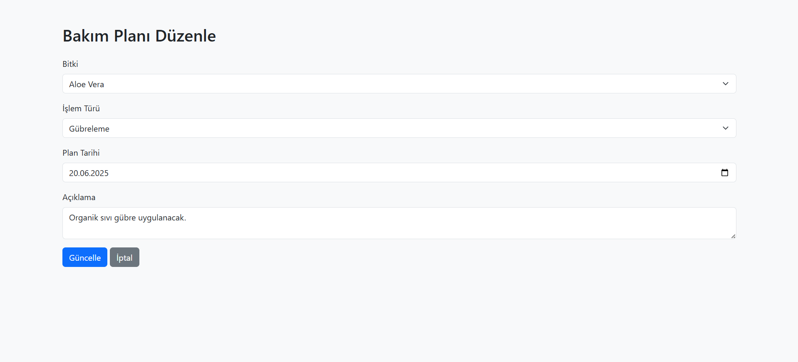

# Botanik Bahçesi Yönetim Sistemi

## Proje Hakkında

Bu web tabanlı uygulama, bir botanik bahçesinin bitki koleksiyonu, sergileri, etkinlikleri, bakım planları, ziyaretçileri ve personel gibi unsurlarını yönetmek için geliştirilmiştir. Proje PHP, MySQL ve Bootstrap kullanılarak geliştirilmiştir.

## Özellikler

- Kullanıcı Kaydı ve Giriş Sistemi (şifreler hash'li olarak saklanır)
- Bitki Yönetimi
- Sergi Yönetimi
- Etkinlik Takibi
- Ziyaretçi Kayıtları
- Bakım Planları
- Personel Yönetimi
- Görev Atama Sistemi

## Kullanılan Teknolojiler

- PHP (Backend)
- MySQL (Veritabanı)
- Bootstrap (Arayüz)
- HTML/CSS

## Kurulum

1. Projeyi `htdocs` klasörüne kopyalayın.
2. phpMyAdmin'de bir veritabanı oluşturun.
3. `botanik_bahce.sql` dosyasını içe aktararak tablo ve verileri oluşturun.
4. `includes/db.php` içinde veritabanı bağlantı bilgilerini kendi sisteminize göre güncelleyin.
5. Tarayıcıdan `localhost/proje-adi` yolunu açarak uygulamayı çalıştırın.

## 📸 Ekran Görüntüleri

### Ana Menü

### Örnek Listeleme

### Örnek Düzenle Sayfası

## 🎥 Tanıtım Videosu

- [Tanıtım videosunu izlemek için tıklayın(henüz değil)]()

---

Bu proje **bitkicayi - Burak Ege Yaşar - tarafından** geliştirilmiştir.
